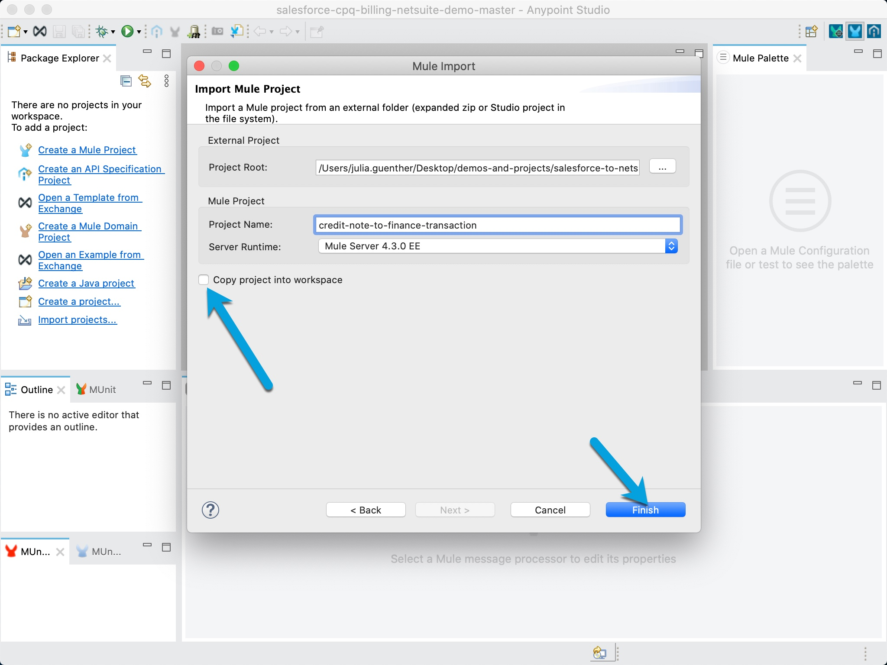
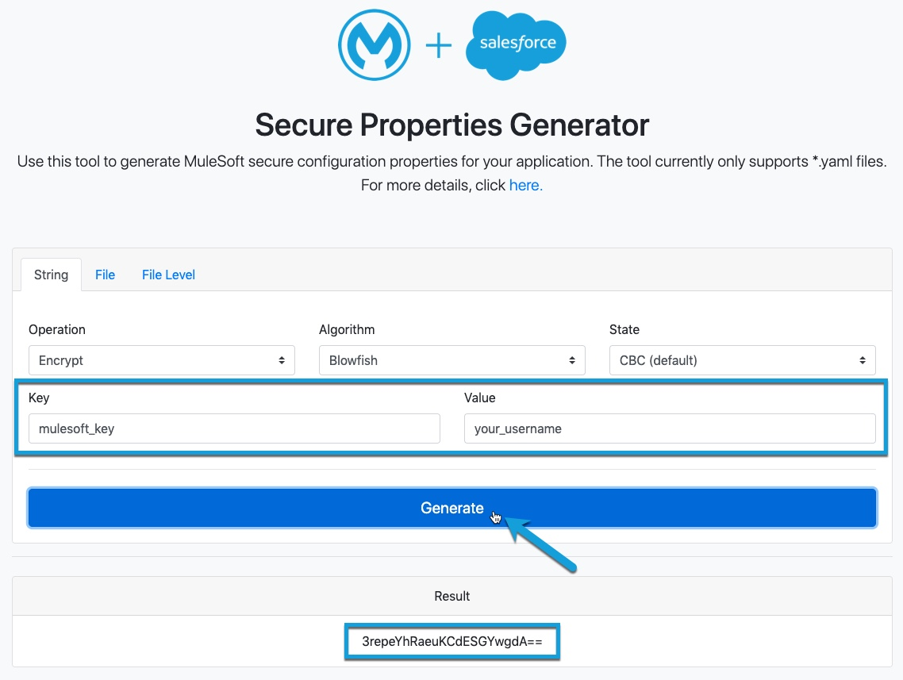

# Salesforce CPQ and Billing Finance Transaction to NetSuite Demo
## Overview
This GitHub repository contains the artifacts for the Salesforce CPQ and Billing to NetSuite Demo.
The purpose of this repository is to help Salesforce CPQ and Billing customers get a head start on setting up the following integrations:
* Salesforce Billing objects (Invoice, Credit Note, Payments) to Salesforce Finance Transactions
* Salesforce Finance Transactions to NetSuite

[Read more about Finance Transactions in Salesforce Billing](https://help.salesforce.com/articleView?id=blng_finance_logging_intro.htm&type=5)

## Scenarios supported by these MuleSoft projects:
1. Post Invoices w/ Lines from Salesforce Billing (including taxes)
2. Post Standalone Payments against an Account
3. Post Credits w/ Lines from Salesforce Billing (including taxes)

## Description of the MuleSoft projects included in this repository:
### Scenario 1 projects (Post Invoices w/ Lines from Salesforce Billing (with taxes):
#### invoice-to-finance-transaction
This project will be triggered when Invoices are “Posted” in Salesforce Billing.  When this happens, a set of new  FinanceTransactions will be created: One for the posted Invoice (with a reference entity type of “Invoice”), plus additional FinanceTransactions for each of the Invoice Lines (with a reference entity type of “Invoice line”) within the Invoice.

#### finance-transaction-invoice-to-netsuite
This project will be triggered whenever a new FinanceTransaction record of reference entity type “Invoice” is created.  It will then create a corresponding Invoice in NetSuite based on the Salesforce Billing Invoice along with it’s associated Invoice Lines based on the products available in the NetSuite product catalog (Inventory Items as they are called in NetSuite), NetSuite accounting period, and tax rate.

**Note:** The products corresponding to the invoice lines need to be available in the NetSuite product catalog (Inventory Items as they are called in NetSuite). Otherwise, the Invoice creation will fail.
The account related to the invoice needs to be present in NetSuite for successful Invoice creation.

### Scenario 2 projects (Post Standalone Payments against an Account):
#### payment-to-finance-transaction
This project will be triggered when Salesforce Billing Payments are “Posted”.  When this happens, a new  FinanceTransaction will be created with a reference entity type of “Payment”.

#### finance-transaction-payments-to-netsuite
This project will be triggered whenever a new FinanceTransaction record of reference entity type “Payment” is created.  It will then create a corresponding “Customer Payment” in NetSuite based on the Salesforce Billing Payment.

**Note:** The account related to the payment needs to be present in NetSuite for successful payment creation.

### Scenario 3 projects (Post Credits w/ Lines from Salesforce Billing (with taxes):
#### credit-note-to-finance-transaction
This project will be triggered when Credit Notes are “Posted” in Salesforce Billing.  When this happens, a set of new  FinanceTransactions will be created: One for the posted Credit Note (with a reference entity type of “Credit memo”), plus additional FinanceTransactions for each of the Credit Note Lines (with a reference entity type of “Credit memo line”) within the Credit Note.

#### finance-transaction-credit-memo-to-netsuite
This project will be triggered whenever a new FinanceTransaction record of reference entity type “Credit memo” is created.  It will then create a corresponding Credit Memo in NetSuite based on the Salesforce Billing Credit Note along with it’s associated Credit Note Lines based on the products available in the NetSuite product catalog (Inventory Items as they are called in NetSuite), NetSuite accounting period, and tax rate.

**Note:**
The products corresponding to the credit note lines need to be available available in the NetSuite product catalog (Inventory Items as they are called in NetSuite). Otherwise, the Credit Memo creation will fail.
The account related to the Credit Note needs to be present in NetSuite for successful Credit Memo creation.

# Steps to configure these projects for your own environment:

## Prerequisites 
- Salesforce instance 
- Netsuite instance 
- Anypoint Studio version 7.7

## Step 1: Download Salesforce CPQ and Billing to NetSuite Demo artifacts from GitHub
Navigate to the the **salesforce-cpq-billing-netsuite-demo** GitHub repository. Click on the Code buttton to clone the repo or download a zip file of the code. 

## Step 2: Configure your Project Workspace in Anypoint Studio
Once you have the code downloaded to your local machine, launch Anypoint Studio. 

It is a best practice to create a new workspace for each project. Therefore, when asked to select a workspace, click Browse and navigate to the directory that you wish to contain the unzipped **salesforce-cpq-billing-netsuite-demo** code.

Select your new workspace to launch Anypoint Studio. Once you have selected your workspace, click **launch** to launch the workspace.

In Anypoint Studio, right-click in the Package Explorer to launch the menu. Select Import. 

In the menu, select Anypoint Studio > Anypoint Studio Project from File System

Click the **Next** button to continue.

Select your Project Root directory using the three dots. 

Inside the directory, click on one of the project folders and click **Open**. 

Deselect the check box next to **Copy Project into Workspace**. 

Click **Finish** to import the project into the workspace. If successful, you will see the project on the lefthand side of Anypoint Studio as pictured below:

Do these steps for each project folder that were in the zipfile.

## Step 3: Configure Salesforce and Netsuite Connectivity
Select one of the projects in your workspace. Navigate to the **config.yaml** for that project.

The **config.yaml** will serve as your non-secure properties file for this project. Update this file with your desired polling interval in milliseconds (**polling_interval**) and your Salesforce authorization URL (**auth_url**) as shown.   

Next, you will need to update your **config-secure.yaml** file with encrypted values. In order to do this, navigate to the **Global Elements** tab and select **Global Property (Configuration)** as pictured below. Find the encryption key **Value** (here **mulesoft_password**).

In a web browser, navigate to our [secure properties tool](https://secure-properties-api.us-e1.cloudhub.io/) as pictured below and enter your encryption key **Value** (here **mulesoft_password**). Enter your username (here **your_username** as an example) and click **Generate** to encrypt your username. Find the encrypted value below and save it for later. Repeat this process to encrypt your password.

Once you have the encrypted username and password, paste these values into the **config-secure.yaml** in the **user** and **password** fields. 

Now you are ready to deploy this project. 

Repeat this process for each project you wish to use. 

